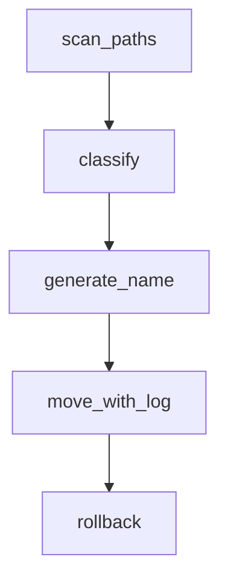

# Architecture

```mermaid
graph TD
    A[scan_paths] --> B[classify]
    B --> C[generate_name]
    C --> D[move_with_log]
    D --> E[rollback]
```

Each module lives in the `sorter/` package and exposes a simple function.
