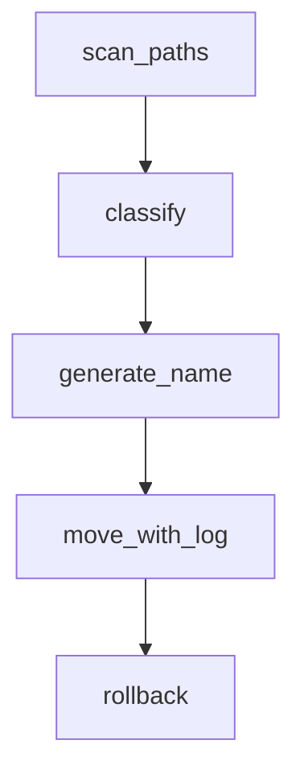

# Architecture



Each module lives in the `sorter/` package and exposes a simple function.

## Application Flow Diagram

This diagram shows the high-level data flow when the `sort` command is executed.

```mermaid
graph TD
    A[Start: file-sorter sort] --> B{Load Config & Rules};
    B --> C[Instantiate Planner, Mover, etc.];
    C --> D[Scanner: Find files in source];
    D -- File List --> E[Planner: For each file...];
    E --> F{Classifier: Match file to a rule};
    F -- Destination --> G[Planner: Create Move Plan];
    G -- Move Plan --> H{Mover: Execute moves};
    H --> I[Reporter: Show summary];
end
```
